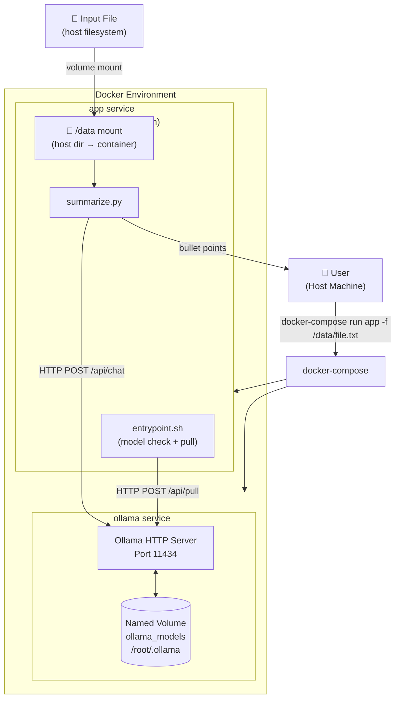
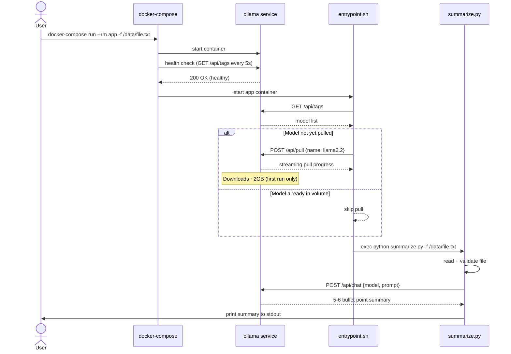

# Architecture

## Overview

`summarize.py` is a containerized CLI tool that accepts any text file and returns a 5–6 bullet point summary. It runs fully locally using [Ollama](https://ollama.com) and the `llama3.2` model — no API keys, no internet required after the first model pull.

---

## System Architecture



---

## Boot Sequence



---

## Project Structure

```text
summarizer/
├── summarize.py        # Core script: CLI parsing, file reading, LLM call, output
├── entrypoint.sh       # Container init: waits for Ollama, pulls model if needed
├── Dockerfile          # App image: python:3.12-slim + curl + dependencies
├── docker-compose.yml  # Orchestration: wires ollama + app services
├── requirements.txt    # Python deps: requests only
├── ARCHITECTURE.md     # This file
└── README.md           # Usage guide
```

---

## Component Breakdown

### `summarize.py`

| Function | Responsibility |
| --- | --- |
| `parse_args()` | Reads `--file` / `-f` from CLI via `argparse` |
| `read_file()` | Opens file, handles encoding errors, truncates if >100k chars |
| `summarize()` | Sends content to Ollama `/api/chat`, returns LLM response |
| `print_summary()` | Formats and prints output to stdout |

### `entrypoint.sh`

Runs before the Python script on every container start:

1. Queries `/api/tags` to check if the model is already cached
2. Calls `/api/pull` only if the model is missing (first run)
3. Hands off to `summarize.py` with all original args via `exec`

### `docker-compose.yml`

| Service | Image | Role |
| --- | --- | --- |
| `ollama` | `ollama/ollama` | Runs the local LLM inference server |
| `app` | Built from `Dockerfile` | Runs the summarizer script |

The `app` service uses `depends_on` with `condition: service_healthy`, so it never starts before Ollama is ready.

### Named Volume: `ollama_models`

Persists downloaded models across container restarts. The `llama3.2` model (~2GB) is downloaded once on first run and reused on every subsequent run.

---

## Key Design Decisions

| Decision | Choice | Rationale |
| --- | --- | --- |
| LLM runtime | Ollama | Free, local, no API key required |
| Model | `llama3.2` (3B) | Small footprint, good quality for summarization |
| Model persistence | Named Docker volume | Survives `docker-compose down`, avoids re-downloading |
| File input | Volume mount (`./:/data`) | User passes any host file without copying into container |
| Large file handling | Truncate at 100k chars | Prevents context window overflow |
| Inter-service comms | HTTP (`http://ollama:11434`) | Standard Docker internal networking |
| Python deps | `requests` only | Minimal footprint; no Ollama SDK needed |
